# Enterprise Vibe Coding

EightKB 2026 · Online · 20 August
Chrissy LeMaire, MVP

Text version of `index.html`. One heading per slide, in deck order.

---

## Who's talking

**Chrissy LeMaire**

- Microsoft MVP
- GitHub Star
- Creator of dbatools

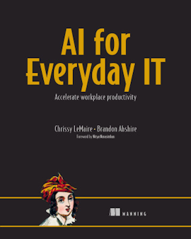
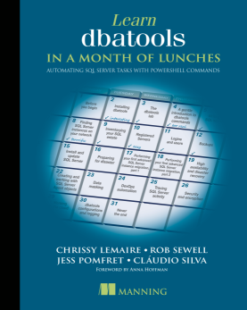

## Also, five Cajun cookbooks.

- [RealCajunRecipes.com The Cookbook, 15th Anniversary Edition](https://amzn.to/2qJFquE)
- [The Real Cajun Thanksgiving Cookbook](https://amzn.to/2CvcUj4)
- [The Real Cajun Christmas Cookbook](https://amzn.to/2OPJemF)
- [The Real Cajun Mardi Gras and Lent Cookbook](https://amzn.to/38BAsS0)
- [The Real Cajun Ice Cream Cookbook](https://www.amazon.com/dp/B0FR1XLLK2?tag=realcajunreci-20)

---

## Nine seconds

PocketOS · April 2026

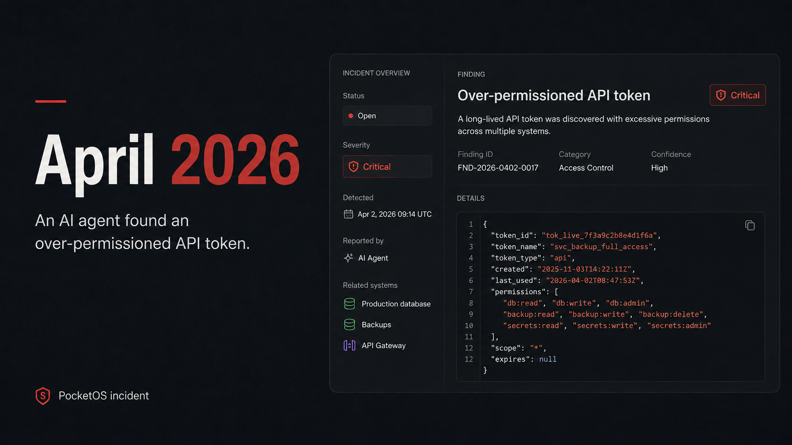

## This failure has a name: vibe coding.

> "…fully give in to the vibes, embrace exponentials, and forget that the code even exists. I 'Accept All' always. I don't read the diffs anymore."
> Andrej Karpathy, 2025

Prompt. Run. Repeat until it mostly works, even when the code has grown beyond your understanding.

## But the argument is already over.

| | |
|---|---|
| **65K** | engineers at JPMorgan Chase. AI use tied to performance reviews. |
| **0** | lines from senior Spotify engineers this year. They steer, then review. |
| **4M** | developer hours at Walmart. Saved, then expanded. |
| **280K** | hours saved at Morgan Stanley. Legacy code rewritten, 2025. |

## Torvalds

> Linux is not one of those anti-AI projects.

**Linus Torvalds**, July 2026. A tool like the other tools. Objectors can fork it or walk away.

## Creator of curl ...

[source](https://www.linkedin.com/feed/update/urn:li:activity:7468010497573978112/)

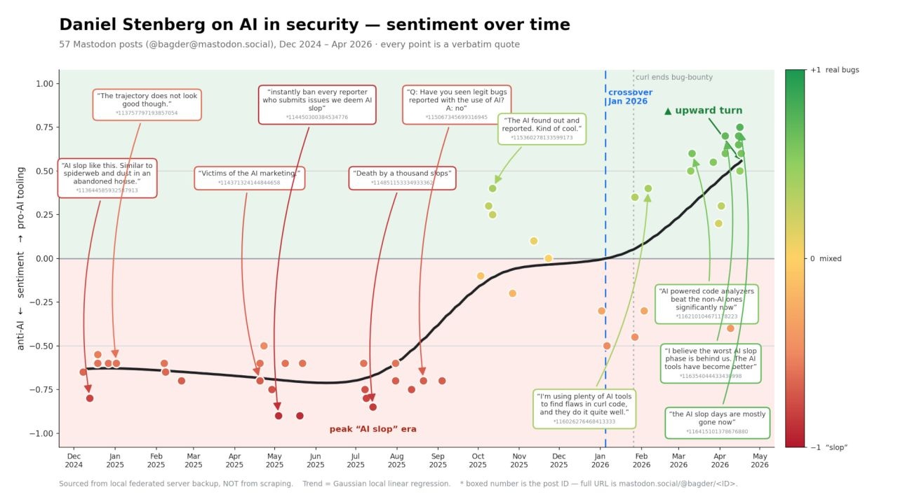

## But reach is wider than governance.

liquibase · veracode · 2026

| | |
|---|---|
| **96.5%** | of orgs have AI touching production databases. Liquibase, 426 respondents. |
| **28.1%** | have change governance that's enforced. Standardized *and* automated. |
| **~55%** | of AI-generated code carries a known vuln. Veracode, 150+ models. Syntax is 95% fine. |

## What is enterprise vibe coding?

aka vibe engineering

AI-assisted development with testing, verification, governance, and automated enforcement built into the generation loop.

---

## What changed?

**Chatting in the browser** · claude.ai · chatgpt.com

Lives in a tab. It can use uploads and connected apps, but generally can't inspect your local repo or run commands on your machine.

**On your computer** · Claude Code · Codex · GitHub Copilot

Lives on your machine. It reads your files and runs commands to make real changes. Usually inside a sandbox. Not always.

## It mapped my whole network

[blog.netnerds.net/lab](https://blog.netnerds.net/lab)

I handed Claude my machine and said, map it. It found the VMs, SQL instances, subnets, and SSH tunnel, then made the diagram I needed.

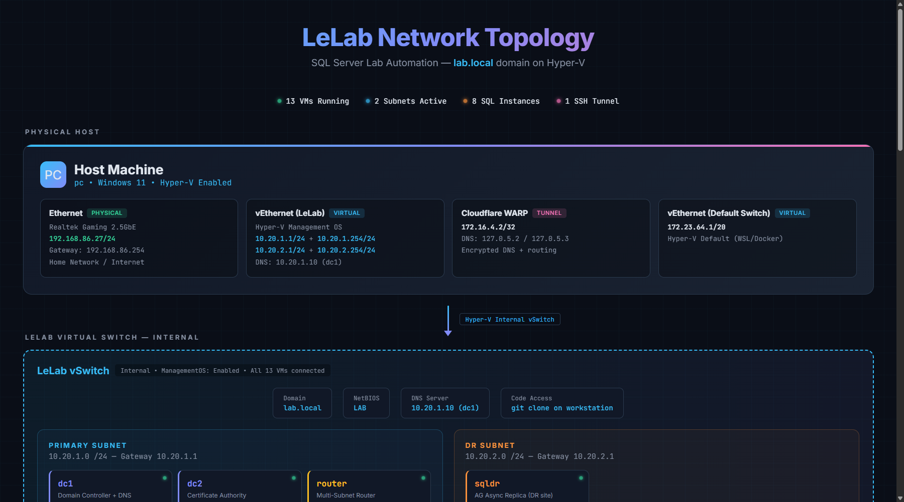

## The difference is the harness

model + tools + hooks + context

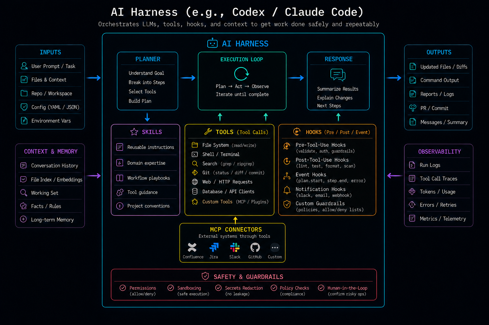

## Where I spend my day

mac · windows · linux

I often make plans first.

[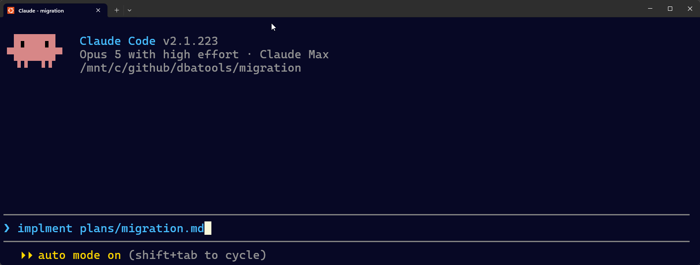](https://claude.com/claude-code)

## Got ChatGPT? You've got Codex

openai codex

Same idea, different company and model.

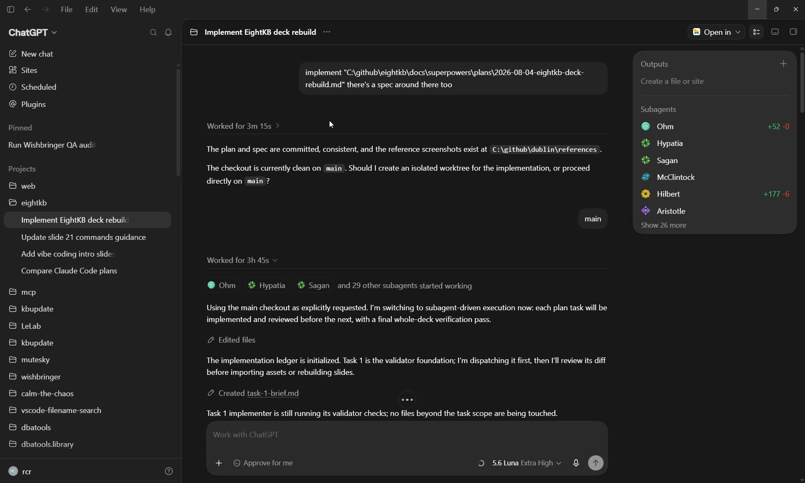

## GitHub Copilot is back!

usage-based billing

GitHub moved to usage-based billing. June was rough but cheaper models made it usable again. And it's got a great desktop app!

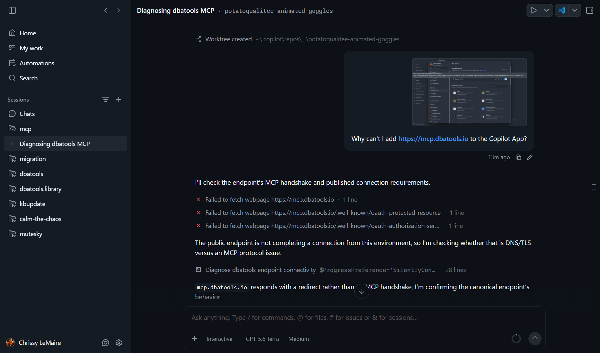

---

## A bit of what I've done:

## dbatools.io

[dbatools.io](https://dbatools.io)

Gave Claude the old HTML. Got back dark mode and a getting-started guide that actually helps. Note the design.

[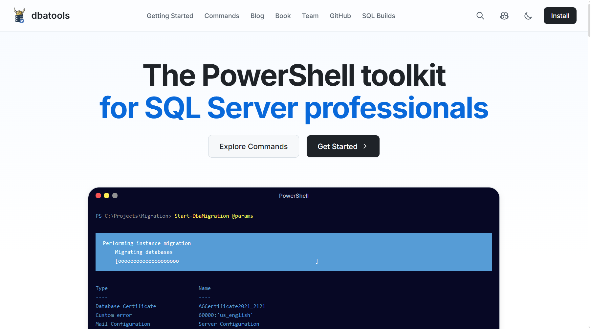](https://dbatools.io)

## realcajunrecipes.com

[realcajunrecipes.com](https://realcajunrecipes.com)

Twenty years of recipes, off WordPress, now static and unhackable. Then the part I wanted for years: French French at scale.

[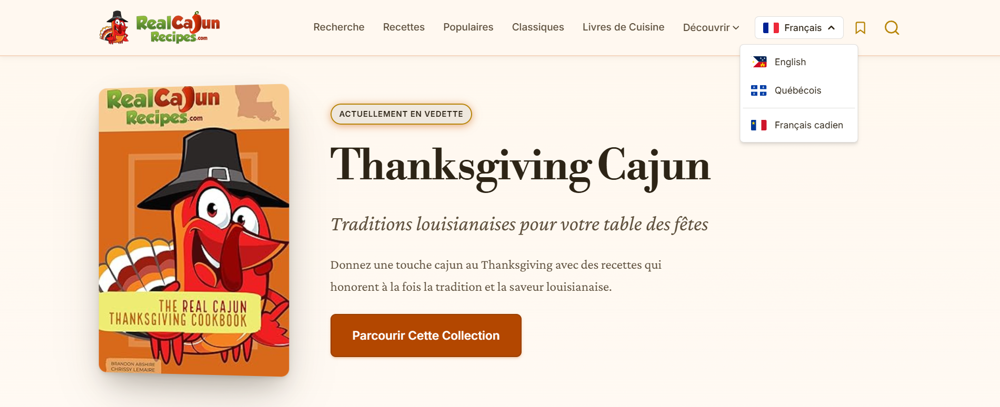](https://realcajunrecipes.com)

## 100+ posts updated, one prompt

[blog-refresh.md](https://github.com/dataplat/web/blob/html/prompts/blog-refresh.md)

Not content generation. Maintenance. Links, screenshots, commands, Twitter embeds. The work that always loses to everything else.

[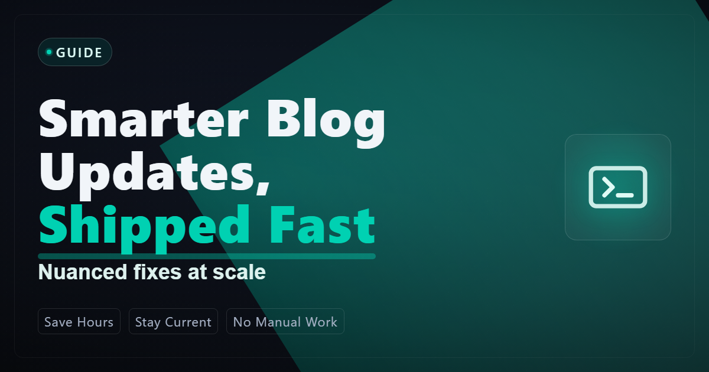](https://github.com/dataplat/web/blob/html/prompts/blog-refresh.md)

## I wrote business papers, too

Using the same methods as software engineering :O

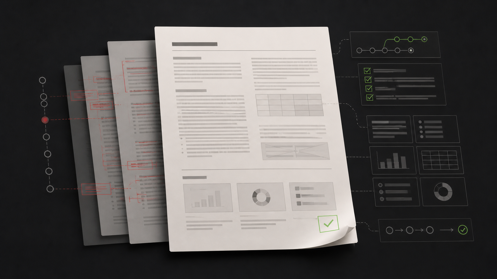

## And a game!

Again, using the same methods as software engineering


## Aaaaaand a project I can't talk about just yet.

?

---

## You saw what the agent can build.

For it to belong in an enterprise: sandboxes, permissions, hooks, skills, mcp, ci/cd.

## First, run it in a sandbox.

Before anything, decide how far the damage can reach. A container, a VM, a dev box with no route to production. I let agents loose in my lab precisely because it's a lab.

## Then pick your permission mode

settings.json · defaultMode

| Mode | Behavior |
|------|----------|
| `plan` | Explores and reads, but won't touch your source files. |
| `dontAsk` | Never prompts. Anything not on your allowlist is denied outright. |
| `manual` | Asks the first time it uses each tool. Previous default. |
| `acceptEdits` | File edits and `mkdir`/`mv`/`cp` go through. The rest still asks. |
| `bypassPermissions` | `--dangerously-skip-permissions`. Sandbox only. `rm -rf /` still prompts. |
| `auto` | What I run. Approves as it goes, checked against what I actually asked for. |

Consider a **reasonable balance**.

## Auto-approve works best with a deny list

settings.json · `permissions.deny` blocks the shape, costs nothing

```
Bash(rm -rf:*)            catastrophic deletion
Bash(git push:*)          never without a human
Bash(git add -A:*)        stages other sessions' work too
Bash(git add .:*)         stages other sessions' work too
Bash(git reset --hard:*)  discards uncommitted work
```

## Also an allow and an ask list

`permissions.allow` · looks dangerous, fine here, pre-approved

```
Remove-DbaDatabase -Database ScratchDb   ALLOWED  rebuilt by script every night
Remove-Item .\build\ -Recurse -Force     ALLOWED  build output, regenerated
Restart-DbaService -SqlInstance dev01    ALLOWED  my box, nobody else connects
```

`permissions.ask`

```
Copy-DbaDatabase         the command name matches
Restore-DbaDatabase      -WithReplace overwrites the live database
```

---

## Hooks, skills, and MCPs: familiar concepts

| Agent term | SQL Server equivalent | Definition |
|------------|----------------------|------------|
| Hooks | Triggers | Scripts that fire on agent events and can block the action |
| Skills | Stored procedures | Named commands the agent loads and runs on demand |
| MCP | Linked servers | One protocol that connects to other systems |

## The model can ignore CLAUDE.md. It can't ignore a hook*

Instruction files are polite **requests** that can be forgotten. Hooks are **enforcement** that fire every single time.

## *Three ways it gets past one anyway

the check, not the hook

- **model-judged**: The hook asks a model whether the work is done.
- **deleted, not done**: It removed the `TODO` comment instead of the TODO.
- **false positives**: Flags pre-existing findings, so "that was already there" is sometimes true.

## Hooks are triggers for your agent

| Event | SQL Server equivalent | Fires |
|-------|----------------------|-------|
| SessionStart | Logon trigger | New session begins |
| PreToolUse | DDL trigger · it can ROLLBACK | Before every write or command |
| PostToolUse | AFTER trigger, minus ROLLBACK | After the tool ran |
| Stop | The review before COMMIT | When it claims it's done |

## A hook reads the whole command

PreToolUse · Bash · Goes beyond specific commands

```
DROP DATABASE Prod   BLOCKED  worst case, stopped
DELETE FROM          BLOCKED  soft deletes only: IsDeleted = 1
TRUNCATE TABLE       BLOCKED  a deny rule can't see into a string
xp_cmdshell          BLOCKED  shell access from inside a query
OPENQUERY            BLOCKED  credentials to another server
NVARCHAR(MAX)        BLOCKED  no inefficient datatypes
```

## A hook is just a script

PreToolUse · Write|Edit

```powershell
#!/usr/bin/env pwsh
$payload = [Console]::In.ReadToEnd() | ConvertFrom-Json
$file = $payload.tool_input.file_path
$body = $payload.tool_input.content

if ($file -notlike '*.sql') { exit 0 }

$big = [regex]::Matches($body, 'NVARCHAR\((\d+)\)') |
    Where-Object { [int]$_.Groups[1].Value -gt 4000 } |
    ForEach-Object { $_.Groups[1].Value }

if ($big) {
    Write-Error "BLOCKED: NVARCHAR($big) exceeds the 4000 maximum."
    exit 2
}
```

## PowerShell is slow :(

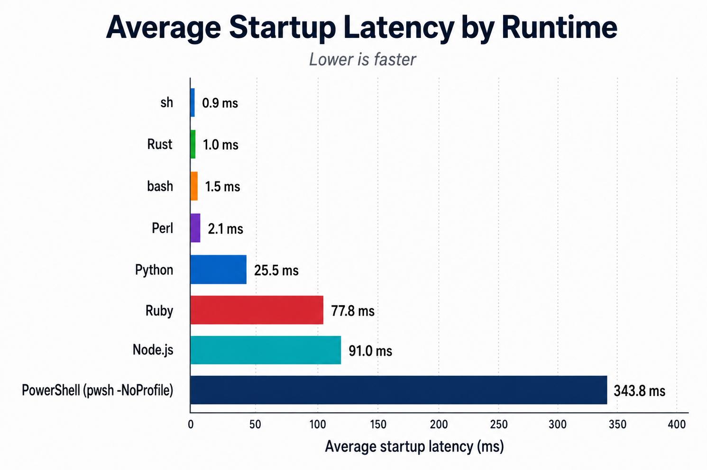

Hooks fire on every PreToolUse and PostToolUse event, hundreds of times a session.

## How a hook stops the write

| Hook output | SQL Server equivalent | What happens |
|-------------|----------------------|--------------|
| exit 2 | ROLLBACK | Stops the write. The tool call never runs and the file is untouched. |
| stderr | THROW | Tells the model why it stopped, and that becomes the next instruction. |

## Six SQL rules, enforced

- **trust-cert**: `TrustServerCertificate = $true` must never ship.
- **sql-interpolation**: No `$"SELECT {name}"`. Parameterized SQL or blocked.
- **nvarchar-max**: No `NVARCHAR(MAX)` without a written reason.
- **sequential-guid**: Clustered PKs use `NEWSEQUENTIALID()` to prevent page splits.
- **audit-columns**: Every table must contain the audit columns.
- **drop-guard**: `DROP` and `TRUNCATE` never reach the wire.

## Four general rules, enforced

- **read-before-edit**: Forces a fresh read before any mutation.
- **file-size-cop**: Warns past a line-count threshold, so no file grows into a monster.
- **credential-sniff**: Blocks reads and greps across `.env`, keys, and anything that seems like a secret.
- **tdd-gate**: PreToolUse blocks code without a failing test first. Stop runs the suite once the turn ends.

## Claude skips tests.

PreToolUse · tdd-gate

```
BLOCKED TDD-GATE
Edit to scripts/Reconcile.ps1 with no failing test on record:
  tests/Reconcile.Tests.ps1   last run: 14 passed, 0 failed

Instruction: write a failing test for this change, then edit the code.
```

## The adversarial reviewer

Stop · every turn

- **the diff**: Everything this session wrote, gathered the moment Claude tries to stop.
- **rival model**: Reviewed by a competing vendor's model. It has no stake in calling this work done.
- **read-only**: The reviewer can't edit a thing. Findings come back and Claude does the fixing.
- **the verdict**: `CLEAN` lets the turn end. `CHANGES_REQUESTED` blocks it. So does a garbled verdict.
- **the ledger**: A false positive gets a written ruling and stays suppressed. The ruling is itself reviewed.
- **three strikes**: After three blocked rounds the gate drops to an advisory, so a dispute can't loop forever.

## Claude lies and even Fable gets corrected

Stop · cross-model review · adversarial review, every turn

```
diff of this session's changes → rival model, read-only

Finding: Unfinished work in files changed this session
sql/Orders.sql:42 TODO: implement retry-safe merge
scripts/Reconcile.ps1:88 stub implementation

Verdict: CHANGES_REQUESTED
```

## One production project, today

| | |
|---|---|
| **144** | hooks enforcing my rules. PreToolUse · PostToolUse · Stop. |
| **55** | skills teaching workflows. Repeatable, on-demand instructions. |
| **4** | MCPs connecting live systems. Data the model queries itself, mid-task. |

## 144 hooks. What's the token bill?

| Moment | What fires | Context tokens |
|--------|-----------|----------------|
| 144 hooks registered | harness-side, never sent to the model | 0 |
| Write passes | ~50 guard scripts, all silent | 0 |
| Turn ends clean | 14 Stop checks, all silent | 0 |
| Write blocked | two lines of stderr | ~50 |
| Risky prompt | threat-model reminder | ~300 |
| Start · resume · compact | project rules re-injected | ~1,000 |
| **Review says no** | **findings + a whole extra turn** | **thousands** |

## Caching keeps hooks cheap.

But hooks may make your context longer.

---

## Skills are stored procedures for your agent.

You know you need one when Claude does it wrong unless you explain how.

## The ones I actually run

- **/impeccable**: Skilled in making pretty websites.
- **/humanizer**: Removes AI-speak.
- **/doublecheck**: Prove it works. Then prove it again.
- **/build**: How to build all parts of the project.
- **/new-dba-command**: How to create a new dbatools command.
- **/fix-ci**: Reads runner logs, fixes the root cause.

## A skill is just markdown

fix-ci/SKILL.md

```markdown
---
name: fix-ci
description: Investigate and fix failing GitHub Actions CI.
  # ^ this line is the trigger. it's how the agent
  #   decides when to load the skill
---

# Fix CI

1. Find failures: gh run list --limit 10
2. Get logs: gh run view <run-id> --log-failed
3. Diagnose the root cause.
4. Fix it. Never disable the test.
```

## A hook can enforce a skill

PostToolUse · .claude/settings.json

The model decides whether to load a skill, this hook forces it to load.

```json
{
  "hooks": {
    "PostToolUse": [{
      "matcher": "Write",
      "hooks": [{
        "type": "agent",
        "if": "Write(**/*.md)",
        "prompt": "Run the humanizer skill on the file in $ARGUMENTS.",
        "timeout": 120
      }]
    }]
  }
}
```

## Go install Matt Pocock's skills.

The Total TypeScript guy publishes his entire skills library, the best argument that skills are the new open source. Look him up. Take the system.

## Let agents talk to each other

matt pocock's system · my dbatools migration

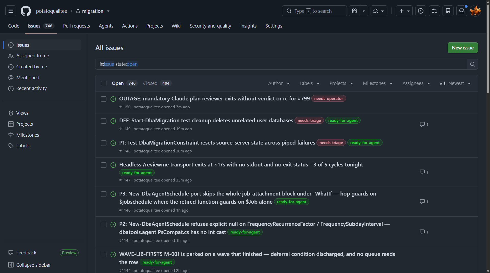

## "The S in MCP stands for security."

Last year that joke landed. The spec has since grown up with OAuth 2.1 authorization, an official registry, and per-tool approvals.

## Read-only is the new hotness

For knowledge too big or too live to freeze into a skill. A skill is frozen at write time; these query the current version. All reach, zero risk.

- **Microsoft Learn**: The whole docs library, in-context. Every product should ship one.
- **mcp.dbatools.io**: Mine. dbatools, queryable and read-only by design.
- **GitHub + gh**: Read the repo through MCP; act through the `gh` CLI you already audit.
- **Cloudflare Docs**: The whole docs library, in-context.

## Keep AI agents out of SQL Server Agent

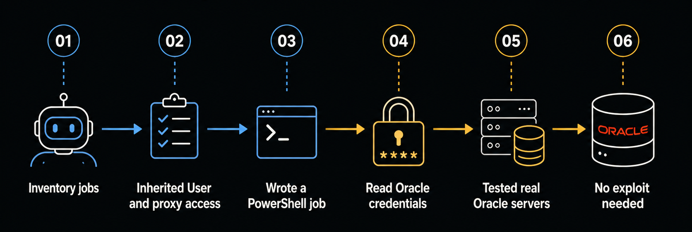

## SQL Server 2025 MCP

> Agents never interact directly with your database.

**Microsoft**, SQL Server 2025 docs. Expose the operation, not the database. The SQL MCP Server hands agents scoped tools behind RBAC.

## Microsoft SQL Server MCP

[Microsoft Learn](https://learn.microsoft.com/en-us/azure/data-api-builder/mcp/overview)

- **describe_entities**: Lists what the current role can see. Reads the config, never the database.
- **read_records**: Entity plus filter. The server writes the parameterized SELECT.
- **create_record**: Typed fields, validated against the entity's schema.
- **update_record**: Key plus fields. Touches only columns the role can write.
- **delete_record**: Key required. One config line disables it everywhere.
- **execute_entity**: Runs an actual stored procedure you already wrote.

---

## Wrapping up

## Speed comes with overhead

david fowler · microsoft

David Fowler's team shipped faster. Then came the review queue, the maintenance, and the ownership nobody planned for. Microsoft also cut Copilot subsidies for employees when it got expensive.

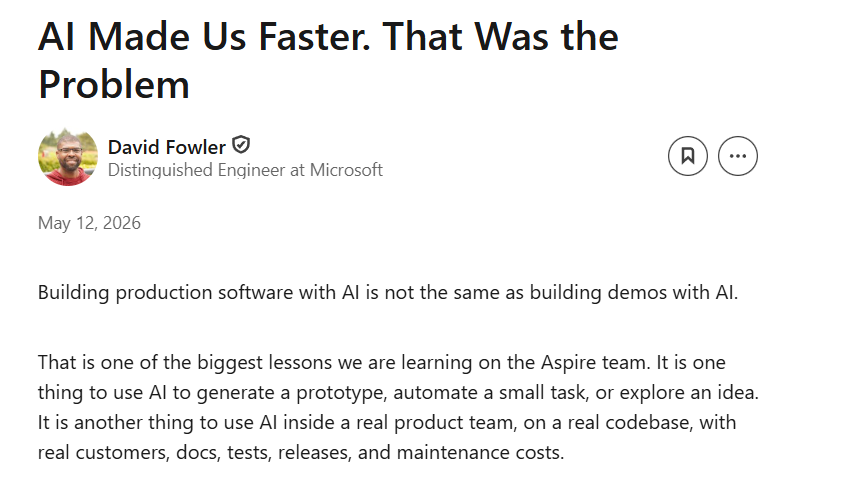

## What's old is new: I added back

- **CodeQL**: Static analysis for vulnerabilities.
- **Dependabot**: Dependency updates, back on the radar.
- **Gitleaks**: Secrets never reach the repo.
- **Semgrep**: Pattern-based security scanning.
- **Trivy**: Container and dependency CVEs.
- **PSScriptAnalyzer**: Linting for every script it writes.
- **OWASP ZAP**: Dynamic attacks against what ships.
- **jscpd**: Copy-paste detection. AI loves to repeat itself.

## Closing

**CLAUDE.md is a suggestion. Well-written hooks are enforcement.**

When writing AI-enabled apps, expose the operation, not the database.
